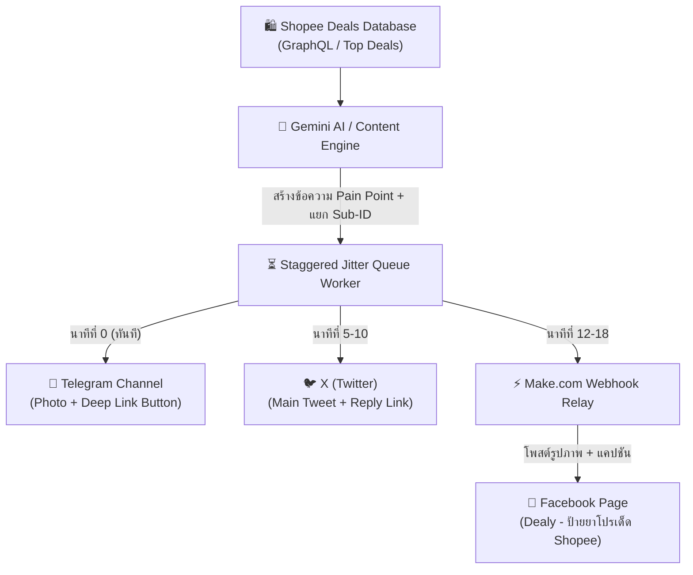

# 🚀 AffiliatePilot AI (Dealy) - 24/7 Autonomous Shopee Affiliate Engine

ระบบตัวแทน AI อัตโนมัติสำหรับบริหารจัดการและเผยแพร่คอนเทนต์ **Shopee Affiliate** ครอบคลุมหลายช่องทาง (**Facebook Page, Telegram Channel, X / Twitter**) ตลอด 24 ชั่วโมง พร้อมระบบหน่วงเวลาแบบกระจายธรรมชาติ (Anti-Suppression Jitter Queue) และระบบดักเวลาทองคำ (Golden Hours Cron)

[](https://render.com/deploy?repo=https://github.com/Auuzp/affiliate-agent)

---

## 🌟 จุดเด่นของระบบ (Core Highlights)

- **🤖 24/7 Production Node.js Engine:** ทำงานบน Express REST API ให้บริการ Dashboard UI ควบคุมแบบเรียลไทม์ และระบบคิวงานอัจฉริยะ
- **🛡️ กลยุทธ์โพสต์ไร้การปิดกั้น (Anti-Suppression Strategy):**
  - **Facebook Page:** โพสต์รูปภาพคุณภาพสูงพร้อมแคปชัน Pain Point โดย **ไร้ลิงก์ภายนอก** ในโพสต์หลัก ➡️ ยิงลิงก์ Affiliate แท้ลงใน **"คอมเมนต์แรก (First Comment)"** ทันที เพื่อป้องกัน Facebook AI ลดการมองเห็น
  - **X (Twitter):** โพสต์ทวีตหลักแบบกระตุ้นความอยาก ➡️ ยิงลิงก์ใน **Thread Reply** ป้องกัน Shadowban
  - **Telegram:** ส่งภาพสินค้าพร้อมปุ่มกด **Inline Keyboard Button (Deep Link)** เปิดเข้าแอป Shopee โดยตรง
- **⏰ 3 ช่วงเวลาทองคำ (Golden Hours Cron):**
  - `23:55 น.` ➡️ ดักโค้ดลดเที่ยงคืน (Midnight Payday & Double Day)
  - `11:50 น.` ➡️ ดัก Flash Sale รอบเที่ยง 12:00 น.
  - `20:00 น.` ➡️ ดีลเด่นนาทีทองรอบหัวค่ำ
- **⚡ Staggered Jitter Queue:** หน่วงเวลาโพสต์แบบกระจายธรรมชาติ (TG ทันที ➡️ X 5–10 นาที ➡️ FB 12–18 นาที) เลียนแบบพฤติกรรมมนุษย์ ป้องกันการถูกตรวจจับเป็นสแปมบอท
- **🎯 Shopee Universal Tracking Sub-IDs:** ฝัง Sub-ID แยกช่องทางอัตโนมัติ (`sub1=tg_deal`, `sub1=fb_page`, `sub1=x_thread`) ตรวจสอบยอดคลิกและค่าคอมมิชชั่นได้แม่นยำ 100%
- **☁️ Cloud & Docker Ready:** รองรับการ Deploy สู่ Render.com, Railway, Fly.io, Google Cloud Run ด้วย Dockerfile และ `render.yaml`

---

## 🏗️ สถาปัตยกรรมระบบ (System Architecture)



---

## 🛠️ วิธีการติดตั้งและรันในเครื่อง (Local Setup)

### 1. ติดตั้ง Dependencies
```bash
git clone https://github.com/Auuzp/affiliate-agent.git
cd affiliate-agent
npm install
```

### 2. ตั้งค่าไฟล์ Environment Variables
คัดลอกไฟล์ `.env.example` เป็น `.env`:
```bash
cp .env.example .env
```
แก้ไขค่าใน `.env`:
```env
PORT=3000
NODE_ENV=development
BASE_URL=http://localhost:3000

# Webhook Relay (Make.com หรือ n8n)
WEBHOOK_RELAY_URL=https://hook.eu1.make.com/xxxxxx
FACEBOOK_PAGE_ID=106756152526353

# Shopee Open Platform (ถ้ามี)
SHOPEE_APP_ID=15349720148
SHOPEE_APP_SECRET=
```

### 3. รันเซิร์ฟเวอร์
- **บน Windows:** ดับเบิ้ลคลิกไฟล์ `START_AFFILIATE_PILOT.bat` ได้ทันที
- **หรือรันผ่าน Terminal:**
```bash
node server.js
```
เปิดเบราว์เซอร์เข้าสู่ Dashboard ได้ที่: `http://localhost:3000`

---

## ☁️ การ Deploy เป็น Web App ออนไลน์ 24 ชั่วโมง (Cloud Deployment)

### วิธีที่ 1: Deploy บน Render.com (แนะนำ - ฟรี & 2 คลิก)
1. สมัคร/ล็อกอินที่ [Render.com](https://render.com) ด้วยบัญชี GitHub
2. กดปุ่ม **New +** ➡️ เลือก **Web Service**
3. เลือก Repository `affiliate-agent` จาก GitHub
4. ตั้งค่า:
   - **Runtime:** Node
   - **Build Command:** `npm install`
   - **Start Command:** `node server.js`
5. ในแท็บ **Environment Variables** ให้เพิ่มตัวแปรจากไฟล์ `.env` เช่น:
   - `WEBHOOK_RELAY_URL` = ลิงก์ Webhook จาก Make.com
   - `NODE_ENV` = `production`
6. กด **Deploy Web Service** ➡️ รับ URL ปลอดภัย (HTTPS) ใช้งานได้ทันที 24 ชั่วโมง

### วิธีที่ 2: Deploy ด้วย Docker
```bash
docker build -t affiliate-pilot .
docker run -d -p 3000:3000 --env-file .env affiliate-pilot
```

---

## 📡 รายการ API Endpoints

| Endpoint | Method | คำอธิบาย |
| :--- | :---: | :--- |
| `/api/health` | `GET` | ตรวจสอบสถานะความพร้อมของเซิร์ฟเวอร์และ Uptime |
| `/api/deals/publish` | `POST` | สั่ง AI สร้างคอนเทนต์และจัดคิวดีลลงระบบ Staggered Jitter |
| `/api/queue/stats` | `GET` | เรียกดูสถิติคิวงานและโควตารายวัน |
| `/api/queue/flush` | `POST` | สั่งปล่อยคิวงานทั้งหมดออกไปยังโซเชียลทันที |
| `/api/queue/clear` | `POST` | ล้างคิวงานที่ค้างอยู่ทั้งหมด |
| `/webhook/telegram` | `POST` | Webhook 24/7 สำหรับรับคำสั่งคุยกับลูกค้าของ Telegram Bot |

---

## 📄 ลิขสิทธิ์และการใช้งาน
พัฒนาสำหรับโครงการ **Dealy - ป้ายยาโปรเด็ด Shopee** เพื่อบริหารจัดการแคมเปญ Shopee Affiliate อัตโนมัติอย่างปลอดภัยและยั่งยืน
